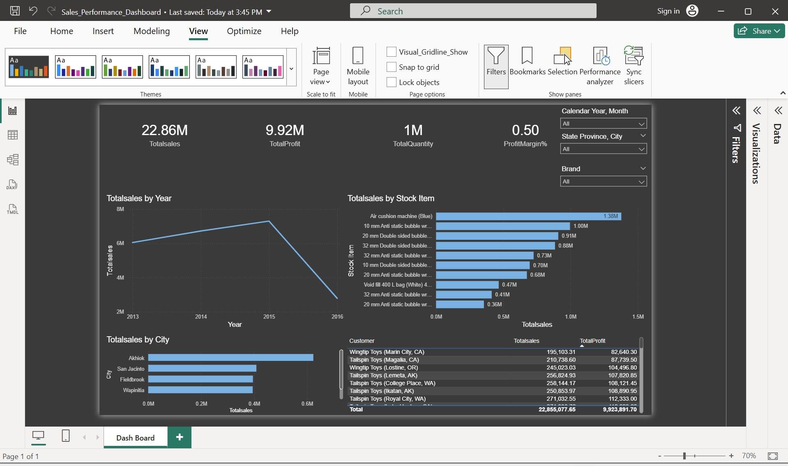
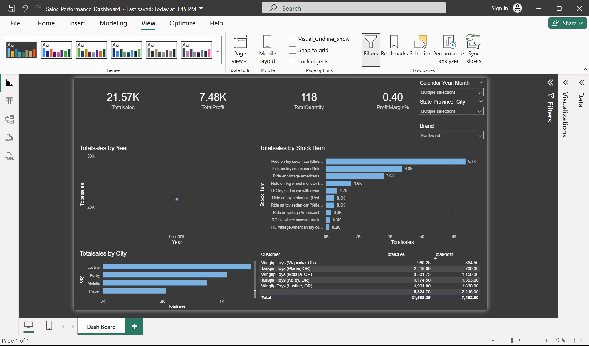

# Sales Performance Dashboard (Power BI)

## Project Overview
This project demonstrates my ability to deliver an end-to-end business analytics solution using Power BI. 
The objective was to analyze sales transactions and uncover insights related to revenue trends, profitability, 
product performance, and geographic distribution.

The dashboard is designed to be simple, interactive, and decision-focused, reflecting real-world reporting 
requirements used by business and operations teams.

---

## What I Did in This Project

### 1. Data Preparation & Cleaning
- Loaded multiple data sources (CSV and Excel) into Power BI.
- Cleaned and transformed raw data using Power Query.
- Fixed headers, data types, and date formats.
- Removed unnecessary columns to improve model performance.

**Skills demonstrated:** Power Query, data cleaning, data preparation

---

### 2. Data Modeling (Star Schema)
- Designed a star-schema data model with:
  - FactSale as the central fact table
  - Dimension tables for Date, Customer, Product, City, and Employee
- Created proper one-to-many relationships to ensure accurate aggregations.
- Marked the Date table to enable time intelligence calculations.

**Skills demonstrated:** Data modeling, analytical thinking, relationship management

---

### 3. DAX Measures & KPIs
Developed reusable DAX measures to support business analysis, including:
- Total Sales
- Total Profit
- Profit Margin %
- Total Quantity Sold
- Year-to-Date (YTD) Sales

These measures allow consistent and reliable analysis across all visuals and filters.

**Skills demonstrated:** DAX fundamentals, KPI development

---

### 4. Dashboard Design & Visualization
- Built a single-page executive-style dashboard.
- Used KPI cards for high-level performance tracking.
- Created line charts and bar charts to show trends and comparisons.
- Added slicers for interactive analysis by year, region, and product.

**Skills demonstrated:** Data visualization, dashboard design, business storytelling

---

### 5. Business Value
The dashboard enables stakeholders to:
- Monitor overall sales and profitability
- Identify top-performing products and regions
- Analyze trends over time
- Make data-driven business decisions quickly

---

## Tools & Technologies
- Power BI
- Power Query
- DAX
- Excel / CSV datasets

---

## Repository Structure
## Screenshots

### Overall Sales Performance Dashboard
This view shows overall sales and profitability across all years, products, and regions.
Key KPIs such as Total Sales, Total Profit, Profit Margin %, and Total Quantity provide a quick executive summary.

---

### Sales Trend and Product Performance Analysis
This view highlights sales trends over time and identifies top-performing stock items based on total sales.
It helps understand which products contribute the most to revenue.

---

### Filtered View – Regional and Brand Analysis
This filtered view demonstrates the use of slicers (Year, City, Brand) to drill down into specific regions and brands.
It enables focused analysis for targeted business decisions.

